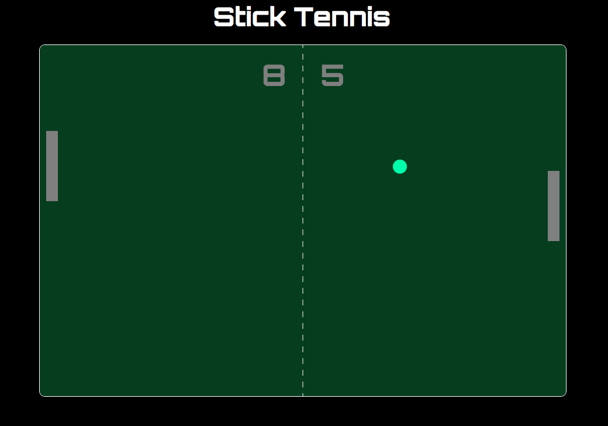

# Stick Tennis

[Live](http://www.wesleyrobinson.me/stick-tennis)

Stick Tennis is a clone of the classic Atari Pong game.  Compete against the computer AI to see if you can outplay him! Use the up and down arrow keys to control your paddle on the right side of the court. Don't get caught sleeping, because game play doesn't stop until one player gets to 11 points!



## Implementation

This project used vanilla JavaScript to handle the game logic and jQuery to manipulate DOM elements on the page, while using webpack to bundle up and serve the various JS scripts.  

As shown below, the bounce angle off of the paddle was calculated by finding the ball's normalized relative intersection with the paddle and multiplying that value with the maximum bounce angle, which I set to (3 * PI / 12).  

```
const maxAngle = 3 * Math.PI / 12;
const relIntY = (paddle.y + (paddle.height / 2)) - this.y;
const normalized = (relIntY / (paddle.height / 2));
const bounceAngle = normalized * maxAngle;
const direction = this.xSpeed > 0 ? -1 : 1;
```

A simple trigonometry function was then performed to calculate the Y velocity of the ball.  

```
this.ySpeed = 12 *  -Math.sin(bounceAngle);
```

To transition between game screens I used jQuery to manipulate the DOM and adjust visibility of elements.  

The AI computer paddle speed is determined by the position of the ball in relation to the center of the paddle.  If the center of the ball is within 5 pixels of the center of the paddle, the paddle moves at the exact same speed as the ball.  Once the ball moves outside of this area, the paddle moves 5 pixels per frame along the y-axis.  

Last but not least, I used the HTML5 Canvas Element to handle rendering of the game court and movement of the ball and paddles.  Using a frame rate of 60fps creates a clear and smooth visual aesthetic.  At each step, the ball moves 12 pixels along the x-axis and, as demonstrated above, a calculated amount of pixels along the y-axis.   

## Future Direction for the Project

In addition to the features already implemented, I plan to continue work on this project.  The next steps for Stick Tennis are outlined below.

### Two Player

Add in the option to have two human players instead of the forced computer AI.

### Difficulty Settings

Create an easy, medium, and hard setting that dictates speed and the ball and paddles.  Another option would be to adjust maximum bounce angle.  
